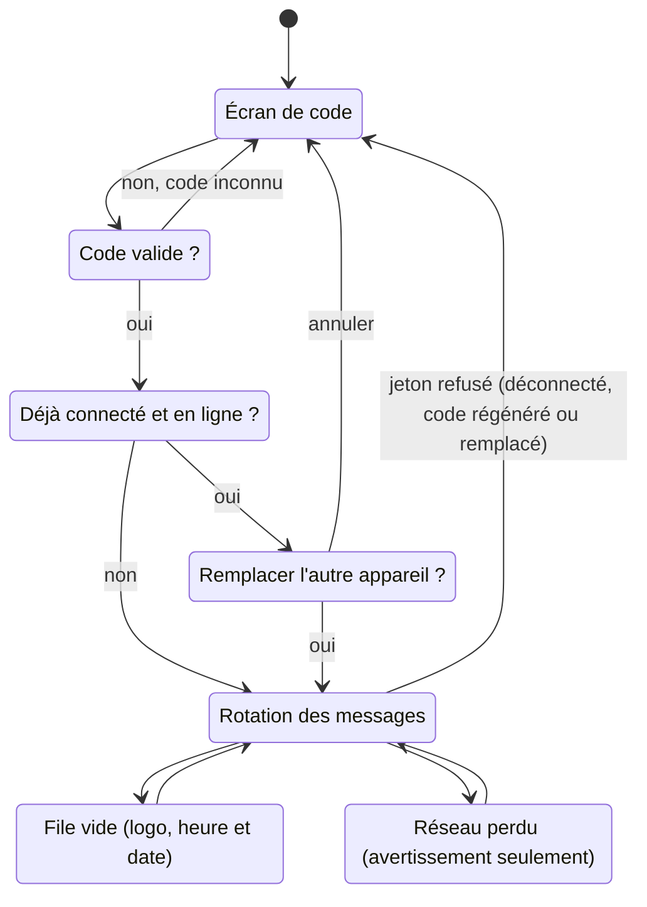

# VitrineExpress — Spécifications du MVP

30 septembre 2026 · Kevin Bélanger

> Version de travail collaborative : https://claude.ai/code/artifact/10313e69-0e8f-40de-9472-0d5f14869246

## Vue d'ensemble

VitrineExpress est une application web qui diffuse des messages (images ou textes) sur des téléviseurs répartis dans les locaux d'un seul organisme, selon les groupes auxquels chaque téléviseur appartient.

- **Portée** : un seul organisme, auto-hébergé sur son propre serveur web.
- **Pile technique** : PHP 8.1 ou plus, base de données SQLite, JavaScript simple (sans framework) pour la page d'affichage.
- **Deux interfaces** : l'interface de gestion (administrateurs, avec code usager et mot de passe) et la page d'affichage (téléviseurs, avec un code à 5 chiffres).
- **Appareils d'affichage** : navigateur web, le plus souvent celui intégré à une télé intelligente, parfois un PC. Ces navigateurs peuvent être anciens : le code de la page d'affichage reste très compatible.
- **Orientation** : paysage (16:9) seulement pour le MVP.

## Concepts

Un téléviseur affiche les messages actifs des groupes dont il fait partie ; les groupes sont à plat, sans imbrication.

- **Téléviseur** : une station d'affichage identifiée par un nom (ex. « Télé local 101 ») et un code à 5 chiffres aléatoire et unique. Il appartient à zéro, un ou plusieurs groupes.
- **Groupe** : un ensemble nommé de téléviseurs, représentant n'importe quoi (local, département, pavillon, « Aire commune »). Un groupe ne contient pas d'autres groupes : on assigne chaque téléviseur à tous les groupes nécessaires.
- **Message** : une image plein écran ou un texte enrichi sur un arrière-plan prédéfini, avec une période d'affichage (début et fin, date et heure) et une durée à l'écran.
- **Ciblage** : un message vise « Tous les périphériques d'affichage », ou un choix de groupes et/ou de périphériques précis. Un groupe inclut aussi les périphériques qu'on y ajoutera plus tard ; un périphérique coché directement n'inclut que lui-même. Les groupes sont donc facultatifs. Sans cible, le message est gardé mais n'est affiché nulle part.
- **File d'un téléviseur** : les messages actifs qui le visent, sans doublon, dans l'ordre de création. Chaque téléviseur peut donc avoir une file différente.
- **Arrière-plan** : un préréglage pour les messages texte, soit un dégradé ou une couleur CSS, soit une image générique, choisi pour garder le texte lisible.

## Modèle de données

Huit tables SQLite suffisent ; les dates sont stockées en texte ISO 8601, dans le fuseau horaire défini dans les paramètres.

| Table | Rôle | Champs principaux |
| --- | --- | --- |
| `users` | Comptes administrateurs | id, username (unique), password_hash, display_name, created_at, last_login_at |
| `devices` | Téléviseurs | id, name, description, code (5 chiffres, unique), token_hash, connected_at, last_seen_at, last_message_id, current_message_id, user_agent, ip, created_at |
| `groups` | Groupes | id, name (unique), description |
| `device_groups` | Appartenance téléviseur ↔ groupe | device_id, group_id (clé composée) |
| `messages` | Messages | id, title (interne), type (`image` ou `text`), media_path, media_mime, text_html, background_id, duration_seconds, start_at, end_at (facultatif), all_devices (0/1), created_by, created_at, updated_at |
| `message_groups` | Ciblage message ↔ groupe | message_id, group_id (clé composée) |
| `message_devices` | Ciblage message ↔ périphérique (direct) | message_id, device_id (clé composée) |
| `backgrounds` | Arrière-plans prédéfinis | id, name, kind (`css` ou `image`), css_value, image_path, text_color |
| `settings` | Paramètres globaux | key, value |

**Paramètres par défaut** (table `settings`) :

- `default_duration` : 20 secondes
- `heartbeat_interval` : 60 secondes
- `offline_after` : 180 secondes (3 minutes)
- `max_upload_mb` : taille maximale d'un fichier téléversé
- `org_name` et `logo_path` : pour l'écran de file vide
- `timezone` : ex. `America/Toronto`

**Notes**

- Le jeton du téléviseur n'est jamais stocké en clair : seulement son empreinte (`token_hash`). Un `token_hash` vide signifie que le téléviseur n'est pas connecté.
- Les fichiers téléversés vont dans un dossier `uploads/` hors de la base, renommés avec un identifiant aléatoire.
- Supprimer un groupe retire ses liens ; les téléviseurs et messages restent.

## Interface de gestion

Sept écrans, accessibles après connexion ; tous les comptes ont les mêmes droits dans le MVP.

1. **Connexion** : code usager et mot de passe. En bas de la page, le lien « Connexion d'un périphérique d'affichage » mène à l'écran de code des téléviseurs.
2. **Tableau de bord** : la liste des téléviseurs avec leur état.
   - En ligne, hors ligne ou jamais connecté, avec la dernière activité (« il y a 2 min »).
   - Le message affiché en ce moment (titre et miniature).
   - Le nombre de messages actifs dans sa file.
3. **Téléviseurs** : liste, ajout, modification, suppression.
   - À l'ajout : nom, description et groupes (cases à cocher). Le code à 5 chiffres est généré et affiché bien en vue.
   - Bouton **Déconnecter** : invalide le jeton ; l'appareil revient à l'écran de code.
   - Bouton **Régénérer le code** : nouveau code unique, et déconnexion de l'appareil actuel.
4. **Groupes** : liste avec le nombre de téléviseurs et de messages de chacun ; ajout, modification (nom, description, téléviseurs cochés), suppression.
5. **Messages** : liste et formulaire.
   - Liste : miniature, titre, type, période, durée, cibles, état (actif, à venir, expiré). Ordre de création.
   - Filtres : par groupe, par téléviseur (montre exactement la file de cette télé) et par état.
   - Formulaire commun : titre interne, début (date + heure, défaut : date de création à 00:00), fin facultative (vide = message permanent ; si une date est choisie, heure par défaut 23:59), durée (défaut 20 s), cibles (groupes ou « Tous les téléviseurs »).
   - Type image : téléversement JPG, PNG, WebP ou GIF, jusqu'à la taille maximale paramétrée.
   - Type texte : éditeur de texte enrichi (gras, italique, titres, listes, alignement, taille) et choix de l'arrière-plan parmi les préréglages.
   - Aperçu 16:9 du rendu final, dans le formulaire.
6. **Utilisateurs** : liste, ajout, modification, suppression des comptes ; chacun peut changer son propre mot de passe.
7. **Paramètres** : durée par défaut, taille maximale des fichiers, nom et logo de l'organisme, fuseau horaire.

Les arrière-plans prédéfinis (environ 8 dégradés et couleurs) sont fournis avec l'application ; leur gestion par l'interface vient plus tard.

## Page d'affichage

Une seule page plein écran, en JavaScript simple, qui passe d'un état à l'autre sans recharger.

Tout refus du jeton, peu importe sa cause, ramène le téléviseur à l'écran de code ; la file vide et la coupure réseau sont des états temporaires de la rotation.

**Connexion par code**

- On ouvre l'adresse du site sur le téléviseur, puis le lien « Connexion d'un périphérique d'affichage », et on entre le code à 5 chiffres (gros pavé numérique, utilisable à la télécommande).
- Si le code est déjà utilisé par un appareil en ligne : « Ce téléviseur (Télé local 101) est déjà connecté sur un autre appareil. Voulez-vous le déconnecter et utiliser cet appareil à la place ? » avec Oui et Annuler.
- Si l'autre appareil est hors ligne depuis plus de 3 minutes, la connexion se fait sans question.
- Une fois connecté, le téléviseur reçoit un jeton gardé dans un cookie de longue durée, avec une copie dans le stockage local. Il reste connecté après un redémarrage.
- Visiter l'adresse du site avec un jeton valide mène directement à l'affichage.

**Rotation**

- La page demande au serveur le message suivant, l'affiche pendant sa durée, puis redemande.
- La réponse contient aussi le message d'après, que la page précharge pour éviter un écran noir entre deux messages.
- Images : affichées au complet, centrées, sans recadrage (*contain*), sur fond noir.
- Textes : le texte enrichi centré sur l'arrière-plan choisi, avec une taille proportionnelle à la largeur de l'écran.
- Transition : fondu enchaîné de 1,2 seconde.

**File vide** : le nom ou le logo de l'organisme, l'heure et la date. La page redemande toutes les 60 secondes.

**Coupure réseau** : un écran d'avertissement seulement, avec un indicateur de chargement et le message « Connexion réseau perdue. Nouvelle tentative en cours… » en bas de l'écran. La page réessaie toutes les 10 secondes et reprend la rotation dès que le serveur répond.

**Déconnexion à distance** : si le serveur répond que le jeton n'est plus valide (déconnecté depuis la gestion, code régénéré ou appareil remplacé), la page efface le jeton et revient à l'écran de code avec un court message explicatif.

**Menu caché** : il apparaît quand on bouge la souris et disparaît après 5 secondes sans mouvement, avec le curseur. Il montre le nom du téléviseur et deux boutons : **Plein écran** (les navigateurs exigent un clic pour y passer) et **Déconnecter cet appareil**.

## Logique serveur

Le serveur calcule la file de chaque téléviseur à chaque demande et retient le dernier message envoyé ; aucune file n'est stockée.

**Calcul de la file** d'un téléviseur, à l'heure actuelle :

1. Prendre les messages dont `all_devices = 1`, ou qui visent au moins un groupe du téléviseur, ou qui visent le téléviseur directement.
2. Garder ceux dont `start_at <= maintenant` et dont `end_at` est vide ou `>= maintenant`.
3. Retirer les doublons et trier par `id` croissant (ordre de création).

**Message suivant** :

1. Prendre le premier message de la file dont l'`id` est plus grand que `last_message_id`.
2. S'il n'y en a pas, recommencer au début de la file.
3. Enregistrer ce message dans `last_message_id` et `current_message_id`, et mettre à jour `last_seen_at`.
4. Renvoyer ce message et le suivant (pour le préchargement), ou une réponse vide si la file est vide.

Conséquences : un nouveau message entre naturellement en fin de file ; un message modifié garde sa place ; un message supprimé ou expiré disparaît sans briser la rotation.

**Présence**

- Chaque appel d'un téléviseur met à jour `last_seen_at`.
- La page envoie aussi un signal de présence toutes les 60 secondes, pour les messages plus longs que ça.
- Un téléviseur est **en ligne** si `last_seen_at` date de moins de 3 minutes, sinon **hors ligne**.

**Connexion unique**

- À la connexion, le serveur crée un jeton aléatoire de 32 octets, en garde l'empreinte dans `token_hash` et renvoie le jeton à l'appareil.
- Un seul jeton par téléviseur : en créer un nouveau invalide l'ancien. L'ancien appareil reçoit une réponse 401 à sa prochaine demande et revient à l'écran de code.

**API de la page d'affichage** (JSON, jeton envoyé par cookie ou en-tête)

| Appel | Rôle | Réponses |
| --- | --- | --- |
| `POST /api/device/pair` | Connexion avec `code` et `force` (0 ou 1) | 200 jeton et nom · 404 code inconnu · 409 déjà connecté et en ligne |
| `GET /api/device/next` | Message courant et suivant | 200 messages · 200 file vide · 401 jeton invalide |
| `POST /api/device/heartbeat` | Signal de présence | 200 · 401 jeton invalide |
| `POST /api/device/logout` | Déconnexion depuis le menu caché | 200 |

Les fichiers médias sont servis depuis `uploads/` sous des noms aléatoires impossibles à deviner.

## Sécurité et contraintes

Les protections de base sont dans le MVP ; la limite de tentatives sur les codes est reportée.

- **Mots de passe** : `password_hash()` et `password_verify()` de PHP.
- **Sessions de gestion** : cookie `HttpOnly`, `SameSite=Lax`, `Secure` en HTTPS ; nouvel identifiant de session à la connexion.
- **Formulaires** : jeton anti-CSRF sur toutes les actions de gestion.
- **Base de données** : requêtes préparées (PDO) partout.
- **Texte enrichi** : nettoyé côté serveur avec une liste blanche de balises et d'attributs, pour empêcher l'injection de script.
- **Téléversements** : type vérifié par le contenu du fichier (pas seulement l'extension), taille maximale paramétrée, nom aléatoire, exécution de PHP interdite dans `uploads/`.
- **Fichiers sensibles** : la base SQLite est placée hors de la racine web, ou protégée par la configuration du serveur.
- **HTTPS** : fortement recommandé, puisque les jetons et mots de passe circulent sur le réseau.
- **Premier compte** : créé par un script d'installation, qui s'empêche ensuite de tourner une deuxième fois.
- **Compatibilité** : la page d'affichage évite les fonctions JavaScript récentes et se teste sur au moins une télé intelligente réelle.

## Hors MVP

Ces évolutions sont prévues plus tard ; le modèle de données leur laisse la place.

| Évolution | Ce que ça demandera |
| --- | --- |
| Vidéos | Type `video` : MP4 (H.264) et WebM, taille maximale paramétrable ; durée = celle de la vidéo |
| Permissions fines | **Fait** : gestionnaires de groupes, voir [specification-gestionnaires.md](specification-gestionnaires.md) |
| Limite de tentatives | Blocage temporaire après plusieurs codes à 5 chiffres erronés |
| Réorganisation de la file | Champ de position, avec une règle claire quand les files diffèrent d'une télé à l'autre |
| Groupes imbriqués | Table de groupes parents, avec protection contre les boucles |
| Mode portrait | Orientation par téléviseur, et aperçu adapté |
| Gestion des arrière-plans | Ajout de dégradés et d'images depuis l'interface |
| Récurrence | Plages horaires ou jours de la semaine pour un message |
